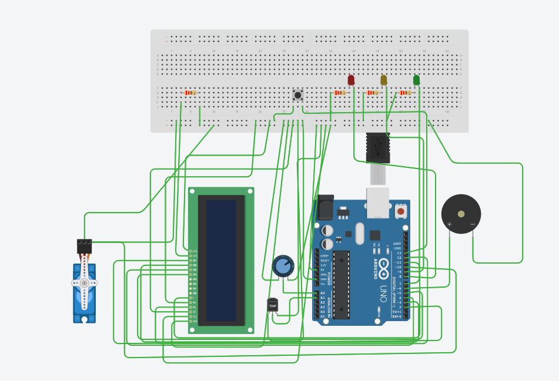
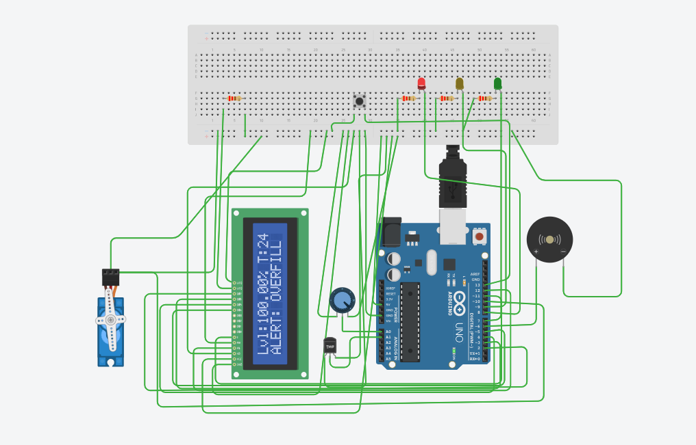

# 🛢️ Automated Tank Level + Temperature Monitoring System

A simulation of a smart industrial control system using Arduino and Tinkercad.  
Monitors liquid level and temperature in a storage tank, controls a pump via servo, and triggers alarms for critical conditions.

## Features
- Simulated **liquid level sensing** using potentiometer
- **Temperature monitoring** with TMP36 sensor
- **Overfill / Low-level / Overheat alerts**
- **Pump control** using servo
- LCD-based **HMI**
- **Manual override** via pushbutton

## ⚙️ Technologies
- Arduino UNO
- Tinkercad Circuits
- Servo Motor
- 16x2 LCD
- TMP36
- Potentiometer, LEDs, Buzzer

## 🧪 Simulation Preview

### 🔌 Circuit Diagram

###  Simulation results

## 🧾 Code Overview
See `Tankmonitoringsystem.ino` for the full Arduino sketch.

## Key Takeway
- Analog signal mapping (for level & temperature)
- Real-time alert logic with thresholds
- Human-Machine Interface design
- Simulating industrial control in Tinkercad

